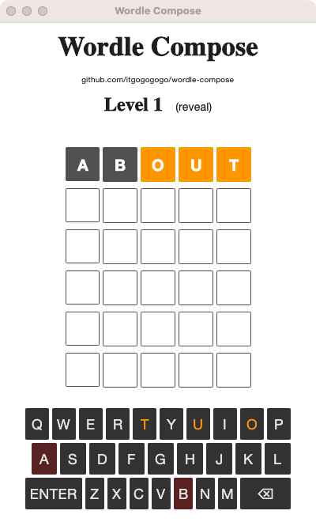

# wordle-compose

该项目是 wordle 猜单词游戏的桌面版本

该项目使用的技术栈：compose for desktop

由于技术栈都是基于 JetBrains 的 Compose ，随参考了 Jetpack Compose 的 Android 版本 https://github.com/adibfara/Faradle

大家感兴趣的可以自行编译，如需帮助，可以在最底部公众号找到我。

示例图

### 公众号

如果有什么需要帮助，可以在这里找到我

